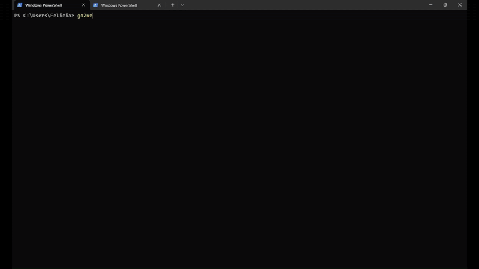

# Installation Guide

## Prerequisites
Ensure you have the following installed on your system:
- Python 3.0 or later
- pip (Python package manager)

## Installation Steps

### 1. Clone the Repository
```sh
git clone <repository_url>
cd <repository_directory>
```

### 2. Create and Activate a Virtual Environment (Optional but Recommended)
#### On macOS/Linux:
```sh
python3 -m venv venv
source venv/bin/activate
```
#### On Windows (PowerShell):
```sh
python -m venv venv
venv\Scripts\Activate
```
#### On Windows (CMD):
```sh
venv\Scripts\activate.bat
```

### 3. Install Requirements
```sh
pip install -r requirements.txt
```
This ensures that all dependencies are installed before proceeding.

### 4. Install the Package
```sh
pip install -e .
```
This installs the package in **editable mode**, allowing you to run it as a CLI tool.

### 5. Set Up Environment Variables
Create a `.env` file in the root directory and add the following:
```ini
GOOGLE_API_KEY=your_google_api_key
SEARCH_ENGINE_ID=your_search_engine_id
```
Replace `your_google_api_key` and `your_search_engine_id` with actual values.

### 6. Usage
To fetch content from a URL, run:
```sh
go2web --url <your url here>
```
To perform a web search:
```sh
go2web --search <your query here>
```
To clear cached data:
```sh
go2web --clear-cache
```
## Notes
- The script stores cached results in a `cache/` directory, which can be cleared using the `--clear-cache` option.


## Demo

[](assets/demo.gif)